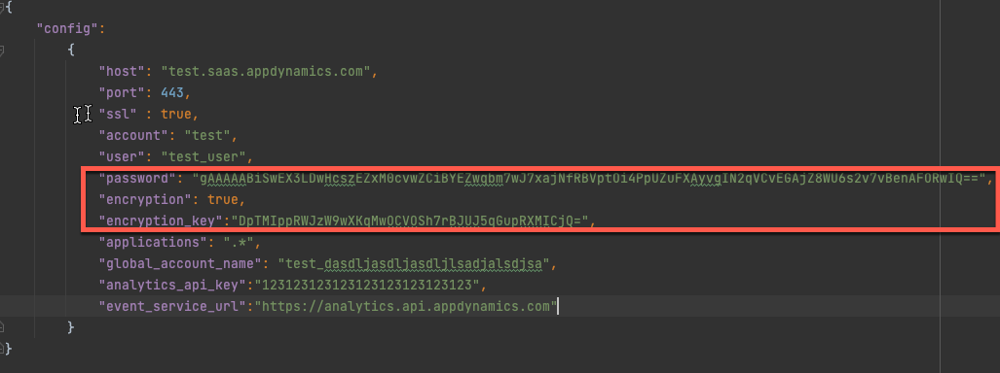

# appd_agents_inventory
python script to create analytics dashbaord as well as a csv report for all machine and app agents


#Step 1: update controller_config.json with your controller access info 
```
{
    "config":
        {
            "host": ".saas.appdynamics.com",
            "port": 443,
            "ssl" : true,
            "account": "",
            "user": "",
            "password": "",
            "encryption": false,
            "encryption_key":"",
            "applications": ".*",
            "global_account_name": "",
            "analytics_api_key":"",
            "event_service_url":"https://analytics.api.appdynamics.com"
        }
}

```
#Step 2: Create Analytics Custom Schema 
```
curl --location --request POST 'https://analytics.api.appdynamics.com/events/schema/agents_inventory' \
--header 'Content-Type: application/vnd.appd.events+json;v=2' \
--header 'X-Events-API-Key: ' \
--header 'X-Events-API-AccountName: ' \
--data-raw '{
    "schema": {
        "controller_name": "string",
        "application_name": "string",
        "node_name": "string",
        "machine_name": "string",
        "agent_type": "string",
        "agent_version": "string",
        "agent_version_number": "integer",
        "agent_age_months": "integer"
    }
}'

```

#Step 3: Run the script or schedule it as a cron job
```
python async_Agents_Version.py 
```
Here is an example on how to schedule the script using windows scheduler:
[Windows Task Scheduler Instructions](Windows%20Task%20Scheduler.docx)

#Step 4: Import the custom dashboards saved in this directory into your controller
1. CustomDashboard_Agents+Inventory+v2_1.json
2. CustomDashboard_Enterprise+Agents+Inventory.json

#Query Using Analytics
You can query the data in analytics. For example, you can get the DB agents using this query
```
SELECT distinct (machine_name), agent_version FROM agents_inventory WHERE agent_type like "Database::*"```
```

#Controller Password Encryption
To configure the controller with encrypted password
1.  encrypt the password using the following command. Below command will generate a key and an encrypted password
```
python3 encrpyt_string.py 
```
Output Example:
```
Enter your password
key:  DpTMIppRWJzW9wXKqMwOCVOSh7rBJUJ5qGupRXMICjQ=
encrypted string:  gAAAAABiSwEX3LDwHcszEZxM0cvwZCiBYEZwqbm7wJ7xajNfRBVptOi4PpUZuFXAyvgIN2qVCvEGAjZ8WU6s2v7vBenAFORwIQ==
```

2. copy they key and encrypted password to your controll_config.json


